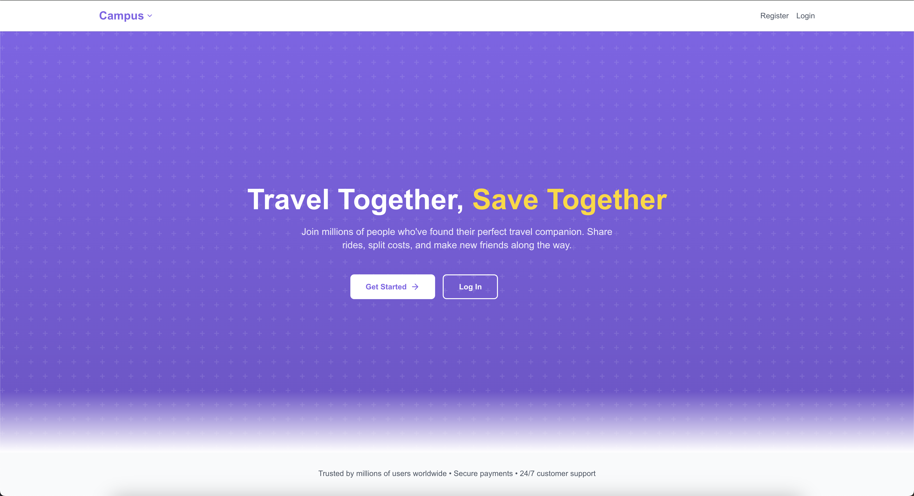

# Campus App 🚗💜

**Travel Together, Save Together**

Campus is a modern web platform that helps college students connect, split ride costs, and make new friends along the way. Whether you're heading home for break or going on a weekend adventure, find your perfect travel companion on Campus.

---

## ✨ Features

- 🚘 Ride-sharing between students
- 💳 Cost-splitting made simple
- 🧑‍🤝‍🧑 Friend-matching for trips
- 🔒 Auth via Firebase with JWT
- 📬 Email support with Resend
- ⚡ Real-time feedback with React Hot Toast
- 🌈 Polished UI with Tailwind CSS and Lucide icons

---

## 🧱 Tech Stack

**Frontend**
- Next.js 15
- React 19
- Tailwind CSS 3
- Lucide React

**Backend / Auth**
- Firebase (Auth, Firestore)
- JWT Decode
- Resend (Email API)

---

## 🖌️ UI Theme

- Light mode only
- White background with purple gradients
- Rounded UI components
- Modern sans-serif fonts
- Minimalist and clean layout

---

## 🛡️ Security

- Firebase Auth for secure sign-up and login
- JWT tokens decoded with `jwt-decode`
- All credentials and secrets stored in environment variables

---

## 📬 Support

If you run into issues or have feature requests:

- Open an issue: https://github.com/your-username/campus-app/issues
- Or reach out to the Campus team directly through the app

---

## 👨‍💻 Author

Made with ❤️ by the Campus team — connecting students, one ride at a time.
